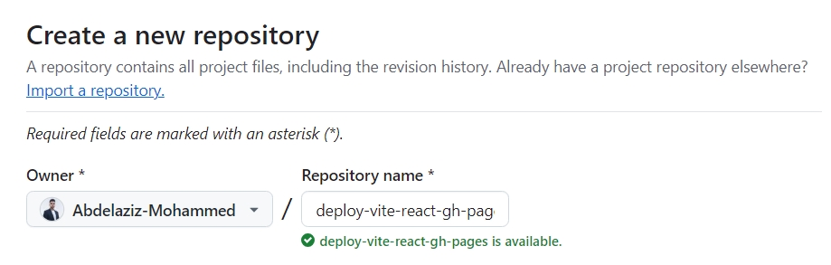
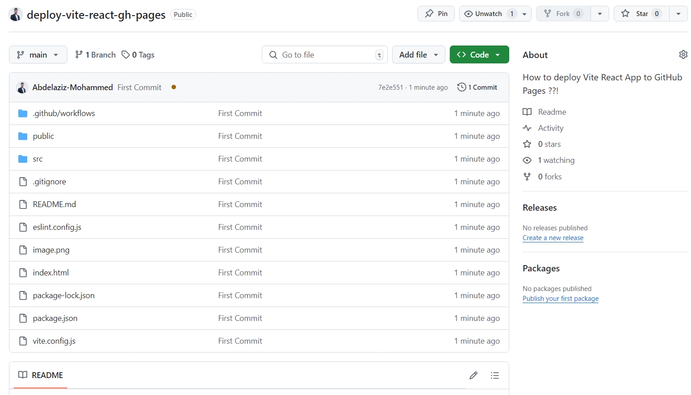
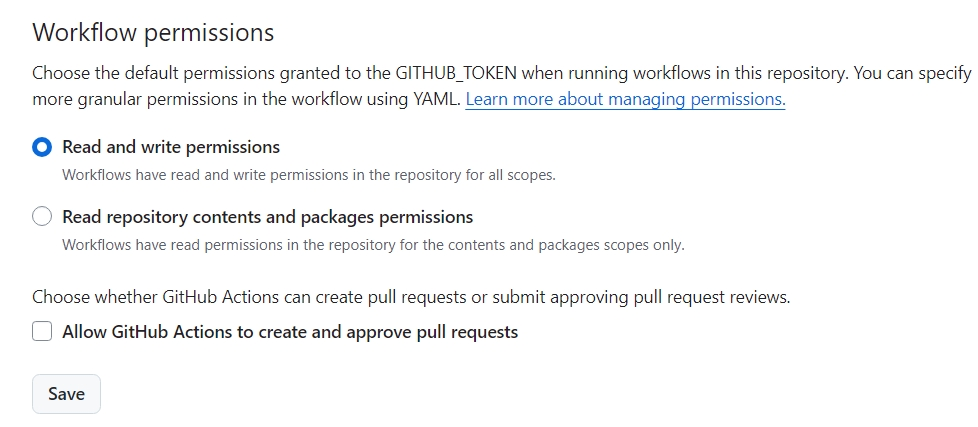

# Deploying a Vite React App to GitHub Pages
This guide walks you through deploying a **Vite React app** to **GitHub Pages** step by step.

## 🌟 Prerequisites
- Node.js installed (`>=16.x`)
- Basic knowledge of Git & React

---

## 📌 Step 1: Install Vite and Create a React Project

1. **Create a new Vite project**
```bash
# Make sure the project folder has the same name as your REPO_NAME
npm create vite@latest
```

2. **Move into the project folder**
```bash
cd deploy-vite-react-gh-pages
```

3. **Install dependencies**
```bash
npm install
```

4. **Run the development server**
```bash
npm run dev
```

5. **Open `http://localhost:3000` in your browser.**
- use `http://localhost:5173` if you haven't changed the default port yet.

---

## 📌 Step 2: Configure Vite for GitHub Pages

- Modify vite.config.js to set the correct base URL:

```js
// vite.config.js
import { defineConfig } from 'vite';
import react from '@vitejs/plugin-react';

export default defineConfig({
  plugins: [react()],
  server: {
    port: 3000, // now server runs on `https://localhost:3000`
  },
  base: '/deploy-vite-react-gh-pages/', // Change this to your GitHub repo name
});

```

---

## 📌 Step 3: Automate Deployment with GitHub Actions

- Create a `.github/workflows/deploy.yml` file:

```yml
# .github/workflows/deploy.yml
name: Deploy

on:
  push:
    branches:
      - main

jobs:
  build:
    name: Build
    runs-on: ubuntu-latest

    steps:
      - name: Checkout repo
        uses: actions/checkout@v4

      - name: Setup Node
        uses: actions/setup-node@v4

      - name: Install dependencies
        uses: bahmutov/npm-install@v1

      - name: Build project
        run: npm run build

      - name: Upload production-ready build files
        uses: actions/upload-artifact@v4
        with:
          name: production-files
          path: ./dist

  deploy:
    name: Deploy
    needs: build
    runs-on: ubuntu-latest
    if: github.ref == 'refs/heads/main'

    steps:
      - name: Checkout repo
        uses: actions/checkout@v4

      - name: Download artifact
        uses: actions/download-artifact@v4
        with:
          name: production-files
          path: ./dist

      - name: Deploy to GitHub Pages
        uses: peaceiris/actions-gh-pages@v3
        with:
          github_token: ${{ secrets.GITHUB_TOKEN }}
          publish_dir: ./dist
```

---

## 📌 Step 4: Create a new repository on GitHub:



---

## 📌 Step 5: Initialize Git, commit all the files and push them to your new repo:

```bash
git init

git add .

git commit -m "first commit"

git branch -M main 

# Replace with your username and repo URL
git remote add origin https://github.com/Abdelaziz-Mohammed/deploy-vite-react-gh-pages.git

git push -u origin main
```

We’ve just successfully pushed our project to GitHub:


---

## 📌 Step 6: On Your Repo Page:

- Go to Settings → Actions → General,
Scroll down to Workflow Permissions,
Choose Read and Write, and save:




## Project Structure

```
/project-root
│── github
│   │── workflows
│       │── build.yml
│── node_modules
│── public
│   │── images
│── src
│   ├── assets
│   ├── App.jsx
│   ├── App.css
│   ├── index.jsx
│   ├── index.css
│   └── ...
│── package.json
│── README.md
```
