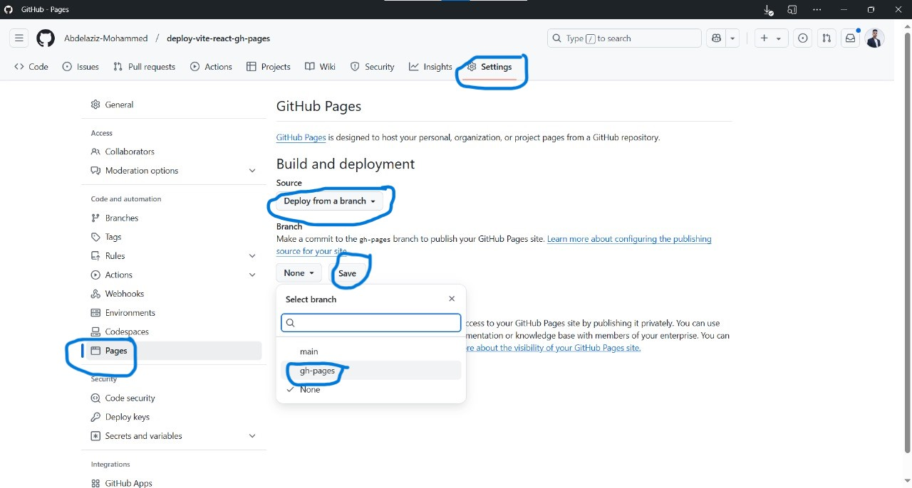

# Deploying a Vite React App to GitHub Pages
This guide walks you through deploying a **Vite React app** to **GitHub Pages** step by step.

## 🌟 Prerequisites
- Node.js installed (`>=16.x`)
- Basic knowledge of Git & React

---

## 📌 Step 1: Install Vite and Create a React Project

1. **Create a new Vite project**
-Make sure the project folder has the same name as your REPO_NAME

```bash
npm create vite@latest
```

2. **Move into the project folder**
```bash
cd deploy-vite-react-gh-pages
```

3. **Install dependencies**
```bash
npm install
```

4. **Run the development server**
```bash
npm run dev
```

5. **Open `http://localhost:3000` in your browser.**
- use `http://localhost:5173` if you haven't changed the default port yet.

---

## 📌 Step 2: Configure Vite for GitHub Pages

- Modify `vite.config.js` to set the correct base URL:

```js
import { defineConfig } from 'vite';
import react from '@vitejs/plugin-react';

export default defineConfig({
  plugins: [react()],
  server: {
    port: 3000, // now server runs on `https://localhost:3000`
  },
  base: '/deploy-vite-react-gh-pages/', // Change this to your GitHub repo name
});
```

- Now server runs on `https://localhost:3000/deploy-vite-react-gh-pages`

---

## 📌 Step 3: Automate Deployment with GitHub Actions

- Create a `.github/workflows/deploy.yml` file:

```yml

name: Deploy

on:
  push:
    branches:
      - main

jobs:
  build:
    name: Build
    runs-on: ubuntu-latest

    steps:
      - name: Checkout repo
        uses: actions/checkout@v4

      - name: Setup Node
        uses: actions/setup-node@v4

      - name: Install dependencies
        uses: bahmutov/npm-install@v1

      - name: Build project
        run: npm run build

      - name: Upload production-ready build files
        uses: actions/upload-artifact@v4
        with:
          name: production-files
          path: ./dist

  deploy:
    name: Deploy
    needs: build
    runs-on: ubuntu-latest
    if: github.ref == 'refs/heads/main'

    steps:
      - name: Checkout repo
        uses: actions/checkout@v4

      - name: Download artifact
        uses: actions/download-artifact@v4
        with:
          name: production-files
          path: ./dist

      - name: Deploy to GitHub Pages
        uses: peaceiris/actions-gh-pages@v3
        with:
          github_token: ${{ secrets.GITHUB_TOKEN }}
          publish_dir: ./dist
```

---

## 📌 Step 4: Create a new repository on GitHub:
-Make sure it is the same as your local project name


---

## 📌 Step 5: Initialize Git, commit all the files and push them to your new repo:

```bash
git init
```

```bash
git add .
```

```bash
git commit -m "first commit"
```

```bash
git branch -M main 
```

- Replace with your username and repo URL

```bash
git remote add origin https://github.com/Abdelaziz-Mohammed/deploy-vite-react-gh-pages.git
```

```bash
git push -u origin main
```


- We’ve just successfully pushed our project to GitHub:


---

## 📌 Step 6: On Your Repo Page:

- Go to **Settings → Actions → General**,
- Scroll down to **Workflow Permissions**,
- Choose **Read and Write Permissions**, and **save**:


---

## 📌 Step 7: Re-run actions

- Go To **Actions → choose a failed deployment → Re-run failed jobs.**
- Wait until in finishes.


---

## 📌 Step 8: Configure GitHub Pages:

- Go to **Settings → Pages**
- Under Source, choose **Deploy from branch** and select the **gh-pages** branch.
- Click **Save**.



---

## 📌 Step 9: Live Site:

- **Now you can see a live site through** `https://YOUR_GITHUB_USERNAME.github.io/REPO_NAME/`

- Replace this with your github name and repo name.

- [Live Site](https://abdelaziz-mohammed.github.io/deploy-vite-react-gh-pages/)


---

## Project Structure

```
/project-root
│── github
│   │── workflows
│       │── build.yml
│── node_modules
│── public
│   │── images
│── src
│   ├── assets
│   ├── App.jsx
│   ├── App.css
│   ├── index.jsx
│   ├── index.css
│   └── ...
│── package.json
│── README.md
```

---

## Author

**Eng. Abdelaziz Mohamed**

- [LinkedIn](https://www.linkedin.com/in/abdelaziz)
- [GitHub](https://github.com/Abdelaziz-Mohammed)

